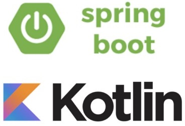

# Kotlin-Spring

### 1. Idea

A basic template that works out of the box.

### 2. Dependencies

- Java
- Kotlin 1.2.41
- Gradle

### 3. Installation

This step only on Windows 10:

- Install Windows subsystem for Linux
- Install Ubuntu from the store
- Install Database (MySQL for example)

Start database service and create database:

    sudo service mysql start
    mysql -u root -p
    Enter password: ****
    mysql> CREATE DATABASE my_db;
    mysql> CREATE USER 'new_user'@'localhost' IDENTIFIED BY 'new_password';
    mysql> GRANT ALL ON my_db.* TO 'new_user'@'localhost';
    mysql> FLUSH PRIVILEGES;

Clone the project:

    git clone git@github.com:Menziess/Kotlin-Spring.git
    cd Kotlin-Spring

Build the project:

    gradle build

### 4. Run

Running the project:

    gradle bootRun

Go to http://localhost:8080/api/customer
